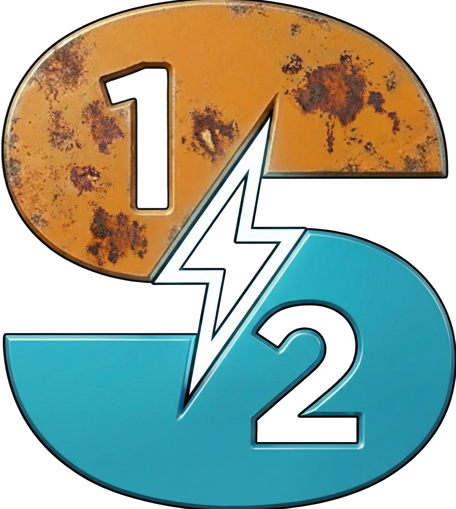

<p align="center">
  
</p>

<h1 align="center">Source2PortTools</h1>

<p align="center">
  Ports Source 1 models, textures, materials, particles, sounds and maps to <b>Source 2</b> (Half-Life: Alyx / S2FM) in one click.
</p>

<p align="center">
  <a href="https://github.com/izzetyarali-arch/Source2PortTools/releases/latest"><b>⬇ Download</b></a> ·
  <a href="https://discord.gg/TnfQdnaF7g"><b>💬 Discord</b></a> ·
  <a href="https://github.com/izzetyarali-arch/Source2PortTools/issues/new/choose"><b>🐞 Report a Bug</b></a>
</p>

---

## What does it do?

Point it at a Source 1 game folder (HL2, Black Mesa, L4D2, GMod content...), pick your Half-Life: Alyx addon as the target, and the program does the rest:

| Source 1 | Source 2 output |
|---|---|
| `.mdl` models | `.vmdl` + binary DMX meshes, animations, physics, bodygroups, flexes/morphs |
| `.vtf` textures | `.png` / `.tga` + `.vtex` / `.vtex_c`, generated PBR maps (normal, roughness, metalness, AO) |
| `.vmt` materials | `.vmat` / `.vmat_c` (PBR, eye shader and wrinkle maps included) |
| `.pcf` particles | `.vpcf` |
| Skyboxes | HDR panorama |
| Sounds | Copied into the addon and compiled |
| `.bsp` maps | `.vmap` *(experimental)* |

No external tools needed: no Crowbar, Blender or VTFEdit. Everything runs inside the program; compiling uses Valve's own `resourcecompiler.exe` from the Workshop Tools.

---

## Highlights

- **Native C++17:** a single multi-threaded application with a Qt5 interface. No Python, no external converters.
- **Built-in model decompiler:** reads `.mdl` (v44–v49), `.vvd`, `.vtx`, `.phy` and `.ani` directly and writes binary DMX meshes and animations plus `.vmdl`, keeping skeleton, animations, flexes and physics.
- **Direct material compiling:** most materials and their textures are written straight to `.vmat_c` / `.vtex_c` without waiting for resourcecompiler. The first material of an unknown kind goes through resourcecompiler once; the same kind after it is compiled directly.
- **GPU texture compression:** BC7 compression runs on the graphics card (Direct3D 11 compute shaders).
- **PBR material generation:** Source 1 shaders (`VertexLitGeneric`, `LightmappedGeneric`, `EyeRefract` and more) become Source 2 PBR materials. Normal, roughness, metalness and AO maps are generated, optionally with a trained AI model, and textures can be upscaled by an AI upscaler.
- **Built-in AI:** a small neural network (about 5.8 million parameters) trained from scratch for this program helps the port along: texture upscaling and cleanup, PBR maps, surface types and wrinkle maps. It runs locally on the CPU or GPU, with no internet connection and no third-party model.
- **Parallel by design:** conversion runs on every core; models compile in parallel resourcecompiler processes while materials are still compiling.

---

## Measured Performance

**The full Half-Life 2 content folder**, conversion only (no compiling), textures upscaled to 2048×2048, 16 worker threads, source on an HDD:

| | |
| :--- | :--- |
| Source | 43,791 files, 8.77 GB |
| Assets converted | 27,779 |
| Output | 110,911 files, 47.1 GB |
| Total time | **49 min 26 s** |
| Peak memory | 7.45 GB |

| Stage | Files | Time |
| :--- | ---: | ---: |
| Models | 3,312 | 65 s |
| Textures | 7,243 | 23 min 12 s |
| Materials | 7,052 | 22 min 36 s |
| Particles | 61 | 1 s |
| Sounds / maps / other | 10,111 | 75 s |

Over 90% of the time goes to texture upscaling and PBR map generation. With the texture size set to **Original**, both the time and the output size drop sharply.

**Half-Life: Alyx character port** (models, materials and full compiling): **17.6 s**.

Times depend on the drive (HDD/SSD), core count, GPU and texture sizes.

---

## Details

### Models & Animations
- Embedded and external animation packages (`*_animations.mdl`, `$includemodel`) are extracted and linked to the model.
- Meshes, physics and animations are written as binary DMX only.
- `.phy` physics models become Source 2 collision shapes.
- Large models that studiomdl split into extra bodyparts (`clamped1`…`clamped8`) are kept whole.
- Damaged `.vtx` files, or ones written by a different compiler version, are read safely: an unreadable part is skipped instead of crashing.
- Eye reflections and eye sockets are set up for human models.

### Textures & Materials
- About 35 VTF formats are decoded in-process: DXT1/3/5, ATI1N/ATI2N, 8-bit RGB/RGBA variants and HDR (16/32-bit float).
- Animated textures and sprite sheets become `.mks` sheets, downscaled when needed to fit.
- Material paths follow the model's `$cdmaterials`. When a model built from parts of several packs has a material in another folder, it is found by file name.

### Maps *(experimental)*
- `.bsp` brushes, faces, displacements, entities, static props and I/O connections are rebuilt as a Hammer 5 `.vmap`, without an intermediate `.vmf`.
- `light_environment`, `light` and `light_spot` become Source 2 lights; skybox names become `env_sky`; a light probe volume is added automatically.

### Resource Use
- The core count and a RAM limit are chosen when a port starts. The RAM limit is enforced: at the limit no new file is started until running ones finish, so the port slows down instead of stopping.
- When the source folder is on an HDD, file scanning uses fewer threads so the disk head does not keep seeking.
- Folder and file names that would exceed Windows' 260-character path limit are shortened automatically.

---

## Requirements

- Windows 10 / 11 (64-bit)
- DirectX 11 (feature level 11_0) capable GPU
- Half-Life: Alyx + **Half-Life: Alyx Workshop Tools** (for compiling)

## Install

Download the latest `.zip` from [Releases](https://github.com/izzetyarali-arch/Source2PortTools/releases/latest), extract it anywhere and run `Source2PortTools.exe`. No installer.

## Command Line

`Source2PortTools.exe` is the interface. Everything can also be done from a terminal with **`Source2PortTools-cli.exe`**, next to it:

```bash
# Full port (no compiling):
Source2PortTools-cli port "E:/hl2" "C:/Steam/steamapps/common/Half-Life Alyx/content/hlvr_addons/my_addon"

# Port and compile, looking for missing models and textures in installed games:
Source2PortTools-cli port "E:/hl2" "C:/.../hlvr_addons/my_addon" --compile --rescue

# Selected files only:
Source2PortTools-cli port "E:/hl2" "C:/.../hlvr_addons/my_addon" models/alyx.mdl models/props_c17/oildrum001.mdl

# Only models and materials:
Source2PortTools-cli port "E:/hl2" "C:/.../hlvr_addons/my_addon" --types models,materials

# Convert a BSP map to a Hammer 5 VMAP:
Source2PortTools-cli map "E:/hl2/maps/d1_trainstation_01.bsp" "maps/d1_trainstation_01.vmap"

# Decompile a single model to SMD/DMX + QC:
Source2PortTools-cli decompile "models/alyx.mdl" "output/alyx"
```

| Command | What it does |
|---|---|
| `port <source> <addon> [file ...]` | Port a Source 1 folder, or only the listed files, into an HLA addon |
| `decompile <model.mdl> [folder]` | Decompile a model (`--transform` turns it to Source 2 axes) |
| `map <map.bsp> <out.vmap>` | Convert a BSP map to a VMAP |
| `texture <file.vtf> [out prefix]` | Decode a VTF to TGA (`--mips` for every mip level) |
| `wrinkle <color> [normal] [ao]` | Make squish / stretch wrinkle maps for a face texture |
| `compile-texture <addon .vtex>` | Compile a `.vtex` without resourcecompiler |
| `compile-material <addon .vmat>` | Compile a `.vmat` without resourcecompiler |
| `check` | Check that every program module works |
| `help` | List every command and option |

`port` options: `--types`, `--compile`, `--rescue`, `--no-pbr`, `--pbr-ai`, `--max-size <N|original>`, `--format png|tga`, `--flat`, `--skip-existing`, `--threads <N>`. Messages follow the interface language, or `--lang tr|en`; `--verbose` shows the full technical log. Exit code: `0` done, `1` failed or finished with errors, `2` wrong usage.

---

## Found a bug?

[Open an issue](https://github.com/izzetyarali-arch/Source2PortTools/issues/new/choose) or tell us on [Discord](https://discord.gg/TnfQdnaF7g). Please attach:
- the latest `logs/Islem_Kaydi_....txt` and `source2porttools.log` (next to the executable),
- the `.dmp` file from the `crash` folder if it crashed,
- the name/path of the file that failed and a screenshot.

The program sends no data anywhere. The only exception is the optional feedback panel, which sends what you type there when you choose to send it.

---

<p align="center">
  Developer: <b>İzzet Yaralı</b><br>
  <sub>Closed source — this repository hosts releases and bug reports only.</sub>
</p>
